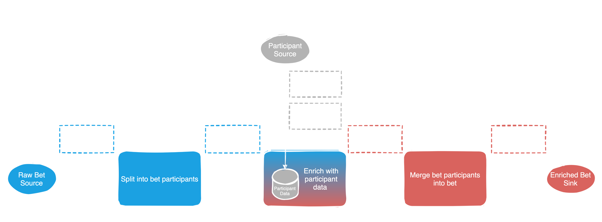

# FootballBetEnricher

An application that enriches a stream of football bets with a stream of football team data.


This implementation results as part of an Apache Flink talk in the `Porto Open Tech Week 2021`, organized by [Blip](blip.pt).


## Run

Requirements: `Java 11, maven & docker`

1 - Startup Kafka with Docker: `docker-compose up`.

2 - Run the app from your favourite IDE, the entry point is: `FootballBetEnricher`. Or run it from the terminal:
```
mvn clean package 
java -jar /target/FootballBetEnricher-1.0-SNAPSHOT.jar
```

## Challenges

### 1 - Complete the code
Right now, the implementation of our `BetParticipantMerger` is missing. 
It should merge the two different `OutboundBetParticipants`, home and away, and create an `OutboundFootballBet`.

**I challenge you to implement it and submit a merge request!**

You can use the `EnrichmentAcceptanceTest` as an extra help to validate everything is ok. 

Hint: Search for `//TODO: Implement the BetParticipantMerger instead of this dummy map`

Note: The test assumes the app is already running.

### 2 - Performance issue

There is a severe performance problem in our application. 

**I challenge you to fix it and submit a merge request!**

Hint: It should be easily identifiable through reading the code but you can extend the `EnrichmentAcceptanceTest` to inject some load. 

### 3 - General improvements

This code is far from being production ready.

**I challenge you to improve it and submit a merge request!**


